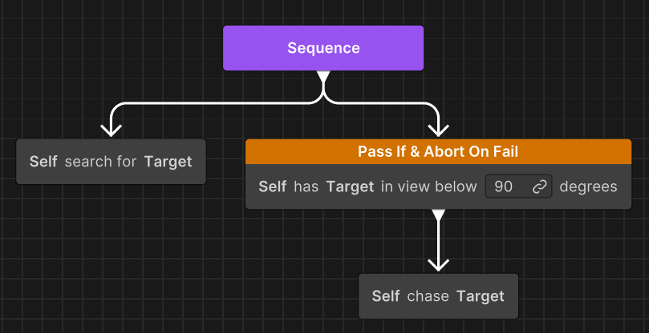
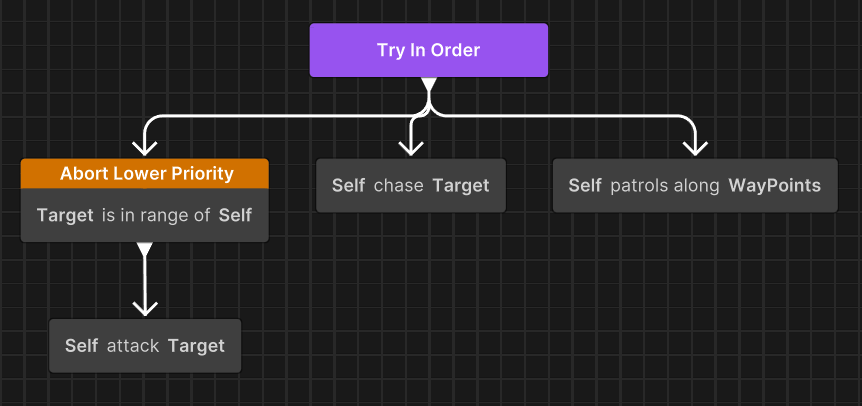
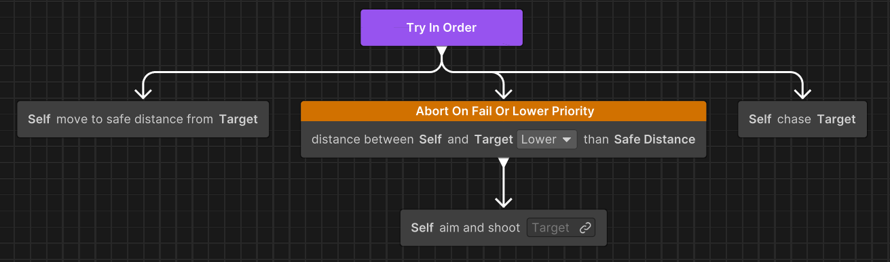

# Observer abort in Behavior

Observer abort monitors the assigned conditions during running and interrupts behaviors when those conditions become true.

When an observer triggers, the following sequence occurs:

1. Observer triggers and interrupts its abort target.
2. Parent composite restarts (`OnEnd()` > `OnStart()`).
3. Composite re-evaluates from child 0.
4. Parent composite remains running; status doesn't propagate upward.

## Local restart in **TryInOrder** (example)

In this scenario, **EnemyInRange** becomes true when the agent patrols:

1. Patrol is interrupted immediately.
2. **TryInOrder** ends and restarts (OnEnd -> OnStart).
3. **TryInOrder** re-evaluates from child 0 (**ConditionalGuard**).
4. As the condition is now true, Attack begins to run.
5. The **Repeat** node doesn't restart. It observes that **TryInOrder** is still running.

**Notes:**
- Conditions are evaluated once per graph tick as long as the parent composite is active.
- The evaluation happens before any node `OnUpdate` is called.
- When an observer condition is met during evaluation, the parent composite:
   - Ends immediately.
   - Recursively ends all its running child nodes (calling all running node `OnEnd`).
   - Restarts in the same frame.
   - The parent calls `OnEnd`, `OnStart`, and `OnUpdate` in that order.

## Observer scope and hierarchy limitations

Observers affect only the siblings of their immediate parent composite. They don't affect:

- Nodes in ancestor composites.
- Nodes in sibling composites at the same hierarchy level.
- Nodes in child composites.

This means an observer can interrupt only branches that share the same parent composite.

## Frame-based condition evaluation

Observer conditions are evaluated once per graph tick (typically once per frame), not continuously during task execution. However, if multiple tasks complete within a single frame, observer conditions aren't re-evaluated between those completions. This can delay interruption by one frame.

**Mitigation strategies**

Use one or more of the following to ensure timely interruption:

- Use a `WaitFrame` node for scenarios that must wait and check condition.
- Use `Status.Running` for actions that must check conditions frequently and allow the graph to tick multiple times.
- Avoid chaining many instant-complete tasks when observers need rapid response.

## ConditionalGuard execution modes

**ConditionalGuard** nodes support two running modes that determine whether observer behavior is available: **Action** and **Modifier**.

In the **Action** mode, the node performs a simple inline condition check. No observer behavior is supported.

In the **Modifier** mode, the node wraps a child node and provides full observer functionality.

When a **ConditionalGuard** node is placed as a direct child of **Sequence** or **TryInOrder**, it automatically switches to Modifier mode to enable observer behavior.

> [!IMPORTANT]
> Currently, no manual override is available for this behavior. The system determines the running mode based entirely on the node’s placement in the graph.

## Available observer nodes

Unity Behavior provides several nodes with observer capabilities.

| Node | Purpose |
|------|---------|
| **Priority Abort** | Priority abort node dedicated for priority-based interruption. |
| **Conditional Guard (Modifier)** | Conditional check with observer support. |
| **Repeat While** | Repeat while condition is true with observer support. |
| **Conditional Branch** | Branch on condition with observer support. |

> [!NOTE]
> The observer feature is only available when using a **Sequence** or **TryInOrder** composite as parent.

## Observer types

Unity Behavior provides four observer types that determine how and when a node interrupts its own running or lower-priority branches.

### None

The **None** abort type provides no observer behavior. It's the default behavior for **Condition Guard/Branch** and **Repeat While** nodes.

- Condition is evaluated only when entering the node.
- The conditions aren't evaluated at the beginning of graph tick for observer abort purposes.
- Can't interrupt lower-priority branches.

### Self

The **Self** observer type monitors conditions while this branch is running. It's useful for maintaining validity of ongoing operations or ensuring prerequisites remain met during execution.

- Monitors conditions while this branch is running.
- Aborts if condition is no longer satisfied..
- Doesn't trigger if the branch isn't currently running.

**Example with `ConditionalGuard`**

The artificial intelligence (AI) chases a target while maintaining line of sight. The guard continuously checks *Can See Target* during the chase. If the target breaks line of sight (condition becomes invalid), the guard aborts the chase and the **Sequence** restarts. This allows the AI to transition to a search behavior.

### Lower Priority

The **Lower Priority** observer type enables priority-based interruption. It's useful in priority-based behaviors where high-priority actions must interrupt low-priority ones.

- Monitors conditions while lower-priority siblings are running.
- Aborts them if condition becomes satisfied.
- The parent composite re-evaluates from the beginning, allowing higher-priority branches to execute.
- Doesn't trigger if this node's own branch is currently running.

The **Lower Priority** observer type shows the following behavior:

- While `Patrol` is running, if `EnemyInRange` becomes true -> Patrol interrupted -> `TryInOrder` restarts -> Attack runs.
- While `Chase` is running, if `EnemyInRange` becomes true -> Chase interrupted -> `TryInOrder` restarts -> Attack runs.
- Monitors conditions as long as `TryInOrder` is running and `AttackEnemy`'s branch is not running.

### Both

The **Both** observer type combines Self and Lower Priority monitoring, providing bidirectional reactivity. It's useful for behaviors that need to both maintain their own validity while running and interrupt lower-priority tasks when opportunities arise.

- Monitors conditions as long as the parent Composite is running.
- Aborts own execution when conditions become **invalid** (Self behavior).
- Aborts lower-priority siblings when conditions become **satisfied** (Lower Priority behavior).
- The parent composite re-evaluates from the beginning.

The **Both** observer type shows the following behavior:

- Interrupts `Chase` when enemy enters range (Lower Priority).
- Interrupts `Attack` when target is too close (Self).

## Additional resources

- [Introduction to observer-based priority interruption](xref:observer-abort-intro)
- [Set up observer nodes in behavior graphs](xref:setup-observer-abort)
- [Troubleshoot observer-based priority interruption](xref:observer-abort-troubleshoot)