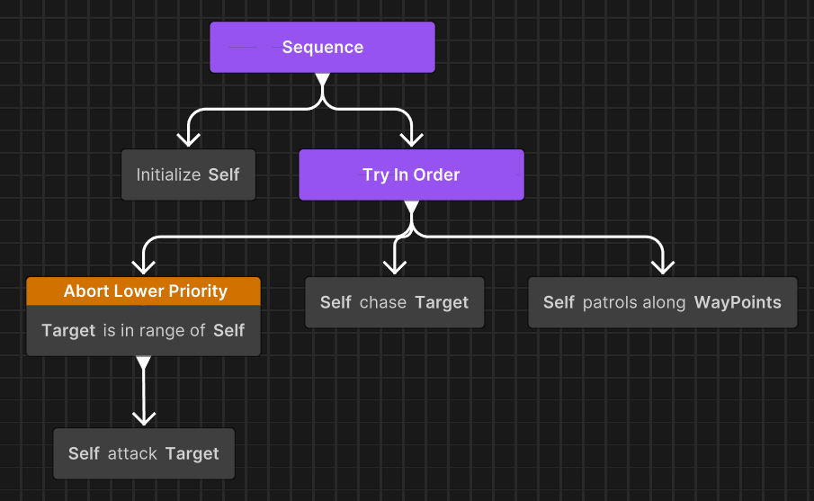

# Troubleshooting observer-based priority interruption

Resolve issues where observer nodes fail to interrupt correctly, interrupt unexpectedly, or cause earlier steps in Sequences to run again.

These issues typically occur when you configure observer nodes for priority-based behavior in **Sequence** or **TryInOrder** composites. Misconfigured abort targets, incorrect node placement, or misunderstanding of restart behavior can lead to unexpected execution flow or missing interruptions.

If you're looking for setup instructions instead, refer to [Set up observer nodes in behavior graphs](xref:setup-observer-abort).

## Observer doesn't interrupt lower-priority behavior

Lower-priority branches continue to run even when the observer condition becomes true. This issue occurs when you test or run a behavior graph that relies on priority-based interruption.

### Symptoms

This issue typically presents with the following symptoms:

- Patrol, Chase, or other lower-priority actions continue to run after the observer condition becomes true.
- High-priority actions never take control.
- Observer appears to be ignored during runtime.

### Cause

This issue is usually caused by incorrect abort target configuration, incorrect priority ordering, or invalid observer placement.

### Resolution

Follow these measures to resolve the issue:

- Verify that **Abort Target** is set to `LowerPriority` or `Both`, not `Self` or `None`.
- Confirm that the observer node is positioned to the left of the siblings it must interrupt (left = higher priority).
- Ensure the condition actually becomes true during runtime (add debugging to the condition if needed).
- Verify that the parent node is a **TryInOrder** or **Sequence** composite.
- Confirm that the observer node is a direct child of the composite **and not nested inside an implicit sequence**.

## Observer interrupts behavior unexpectedly

Branches are interrupted even though the interruption wasn't intended. This issue commonly appears during testing after adding multiple observer nodes or modifying conditions.

### Symptoms

This issue typically presents with the following symptoms:

- Actions stop suddenly without any logical reason.
- Setup or preparation steps re-run unexpectedly.
- Behavior constantly switches between branches.

### Cause

Unexpected interruptions usually happen due to overly broad conditions, incorrect abort target selection, or conflicting priority observers.

### Resolution

Follow these measures to resolve the issue:

- Check whether **Abort Target** is set to `Both` when you intended to use `Self` or `LowerPriority`.
- Review the condition logic to ensure it's not triggering too frequently.
- Verify priority order (observers further left have higher priority).
- Check for multiple observers with overlapping conditions.
- Remember that when an observer triggers, the parent composite always restarts from child 0.

## Earlier steps re-execute in a Sequence

Earlier steps in a **Sequence** run again after an observer triggers. This issue appears when using observers under a Sequence composite.

### Symptoms

This issue typically presents with the following symptoms:

- Setup or initialization steps repeat unexpectedly
- One-time actions run multiple times
- Sequence appears to restart from the beginning

### Cause

This is an expected behavior. When an observer triggers, the parent composite always restarts from child 0.

### Resolution

To prevent earlier steps from re-running, nest the observer inside a **TryInOrder** instead of placing it directly under a **Sequence**:

## Additional Resources

- [Introduction to observer-based priority interruption](xref:observer-abort-intro)
- [Observer abort in Behavior](xref:observer-abort-mechanics)
- [Set up observer nodes in behavior graphs](xref:setup-observer-abort)